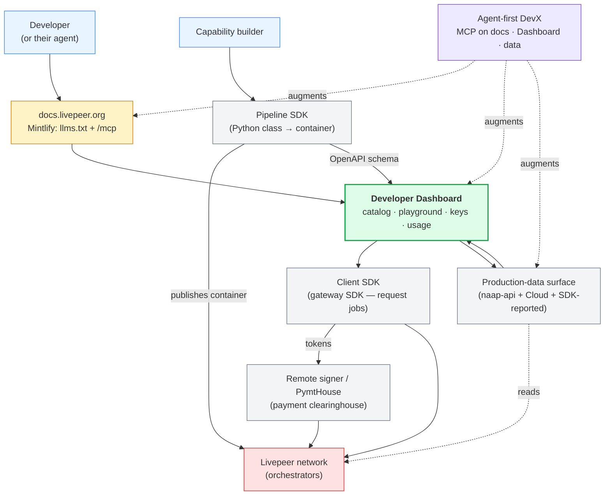

# 5-min Developer Journey

Livepeer is a decentralized, open GPU network. The Foundation's current bet is **real-time AI video** — a category no centralized provider has claimed yet. Near-term growth comes from the builders on the edges: **creative technologists, early-stage developers, and startups shipping real-time video-AI workloads**. They will trade polish and SLAs for dramatic cost and novel capability — a trade enterprise won't make yet, which is why the path to enterprise runs through the edges, not around them.

## Focus: demand

On the engineering side, we're running two demand workstreams:

1. **Working directly with solution providers** — Blue Claw, Daydream, Stream.place, Frameworks, Flipsuite. Understanding their problems and co-building what they need to onboard the network. Relationship-driven; not covered by specs in this folder.
2. **Making the network easier for any developer to see, try, and build on** — the focus of this folder.

## What this track is about

Letting a developer discover what Livepeer can do, experiment with it in minutes, and put their own jobs on the network — without direct hand-holding from the Livepeer community.

Recent months have shipped a lot that feeds this funnel:

- **A refreshed website and new [ecosystem page](https://livepeer.org/ecosystem)** — the public surface now reflects Livepeer's strategy and shows what's already running on the network.
- **A remote signer (payment clearinghouse) and local SDKs** — a new actor in the Livepeer system that handles payments on behalf of developers. Paired with the local SDKs shipped alongside it, builders can partner with a signer and use the network without touching tickets, signing, or gateway internals.
- **A BYOC stack from the AI SPE** — Bring Your Own Container rails that let more versatile job types land on the Livepeer network.
- **Explorer back under active maintenance and being restyled** — the participation portal for operators and delegators, and the sibling surface to the developer dashboard.
- **Subgraph maintained again, with data upgrades** — gateway tracking, treasury tracking, delegator-income tracking (coming) — unlocking richer visualisations across Livepeer applications.
- **Real-time network metrics** from the Cloud team — see [Metrics and SLA foundations for NAAP](https://forum.livepeer.org/t/metrics-and-sla-foundations-for-naap/3189/13). The production-data story a developer needs to judge fit is measurably better.
- **Documentation improvements** — landed via the [documentation-restructure RFP](https://forum.livepeer.org/t/rfp-documentation-restructure/3071); upcoming work simplifies stakeholder journeys further.

Taken together, these engineering tracks have focused on two things: first, **empowering the community to land their demand bets on the Livepeer network**; second, **letting developers see what the network can offer and start experimenting with it directly**. The specs in this folder pick up from there.

## Outcome

> A developer/builder/provider with no prior Livepeer experience — using Claude, Cursor, or any MCP-compatible tool — can discover Livepeer, authenticate, and make their first working Video AI API call in under 5 minutes, and orchestrators/providers can self-serve put new work on the network via an opinionated, well-documented interface compatible with the BYOC pipeline — without Foundation support.

## Components

Each gets its own spec in this folder. The **Developer Dashboard** is the umbrella surface a developer lands on; the components below are what enable it — the substrate it is built on and what it makes visible.

- **[Developer Dashboard](./developer-dashboard.md)** — catalog, playground, key issuance, billing. The community-owned surface the components below plug into to form one product.
- **[Client SDK](./client-sdk.md)** — the SDK a developer uses to request jobs from the network. *(spec TBD)*
- **[Pipeline SDK](./pipeline-sdk.md)** — the SDK a builder uses to package a new job type as a container that orchestrators can opt into running. Not automated run-any-code deployment; the orchestrator remains in the loop. *(spec TBD)*
- **[Remote-signer clearinghouse](./remote-signer.md)** — payment abstraction that removes the need to run a local gateway. Paired with the client SDK, the developer partners with a signer instead. *(spec TBD)*
- **[Production-data surface](./production-data.md)** — richer network data so a developer can judge whether Livepeer can serve their use case, and see how it's already being used. *(spec TBD)*
- **[Agent-first DevX](./agent-first-devx.md)** — the cross-cutting design principle and infrastructure (`llms.txt`, Dashboard MCP, production-data MCP) that makes every surface above legible to AI coding agents, not just humans. *(spec TBD)*

## How it fits together

> [!NOTE]
> The diagram below is **one example** of how these components could fit together — not a committed architecture. The actual shape will be decided in discussion with the community as the specs below mature, and is expected to shift. Treat it as a shared starting point for the conversation, not a blueprint.

Reading the diagram:

- **Two entry flows.** A developer (or their agent) enters via the docs → Dashboard path. A capability builder enters via the Pipeline SDK path directly to the network.
- **The Dashboard is the umbrella** (green, thick border) that composes the four infrastructure components below it.
- **The Remote signer / PymtHouse sits between the SDK and the network** — the Client SDK exchanges its token bundle with PymtHouses; PymtHouses hold the wallet and pay orchestrators.
- **Production-data flows two ways** — it reads network state from orchestrators and feeds the Dashboard's capability catalog, stats, and rankings.
- **Agent-first DevX is cross-cutting** (purple, dotted) — not a peer component, but an MCP layer that augments three other surfaces.
- **Ownership is legible.** Component owners can see exactly what feeds their component and what consumes its output.

## Out of scope

- **A fully optimised runtime for custom containers.** These specs optimise for discovery, first-call, and self-serve — not peak throughput, SLAs, or a finished custom-pipeline UX.
- **Modal.com-style "run any code" automated deployment.** The current self-serve path is *package a container, orchestrators opt in to run it* — not one-command deployment of arbitrary code. Closing that gap is a later track.
